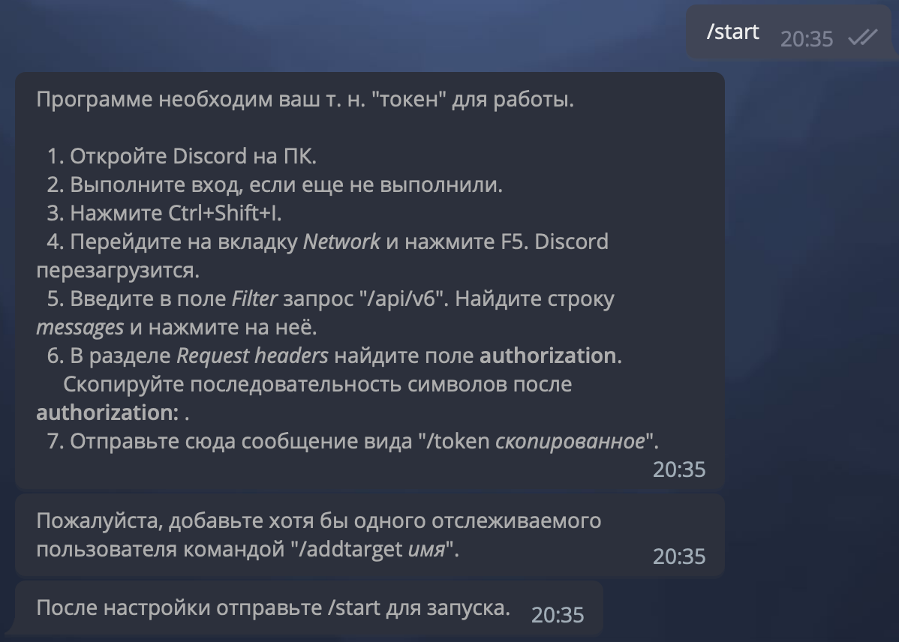
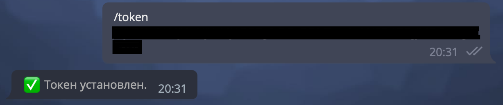
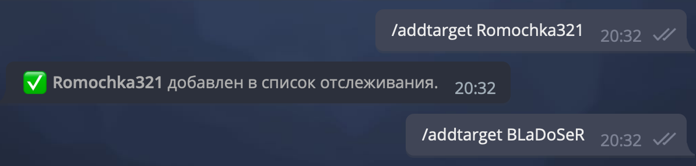
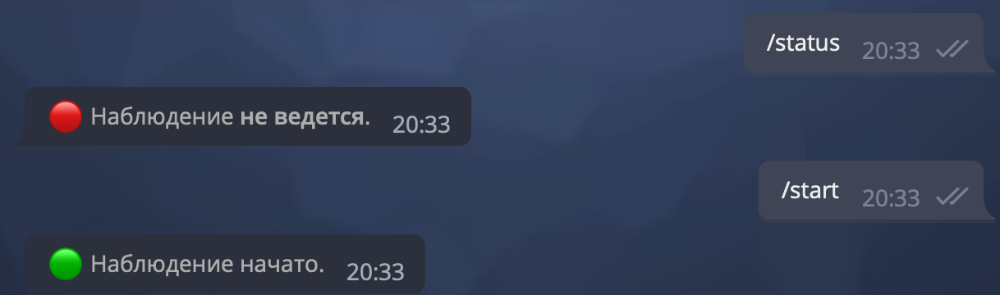
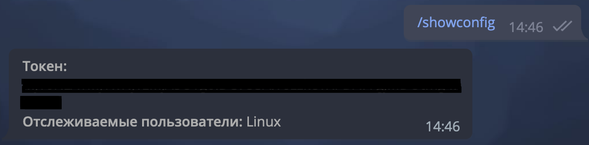
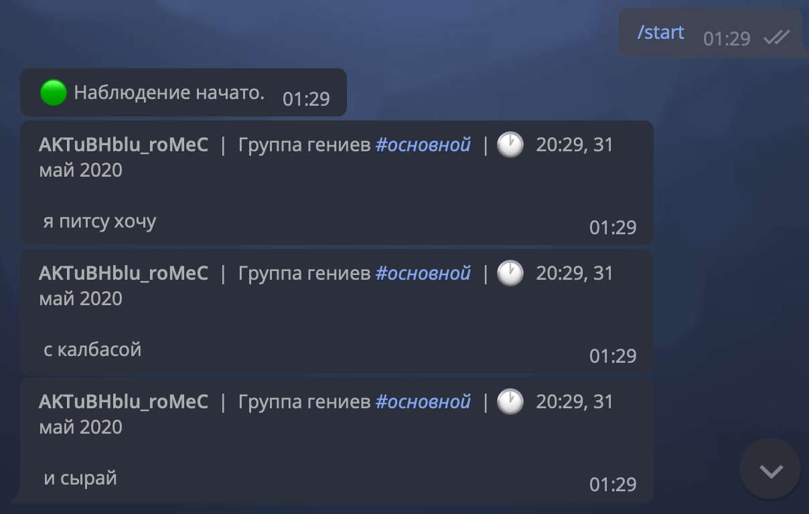

# discord-notifier
Телеграм бот, служащий для переотправки сообщений, приходящих вам от пользователей в мессенджере Discord. Добавьте ваш токен и пользователей, от которых хотели бы получать сообщения. Таким образом вы будете получать уведомления от данных пользователей Дискорда в Телеграм.

## Начало

## Установка токена

## Добавление пользователей

## Статус

## Показ конфигураций 

## Пример работы

